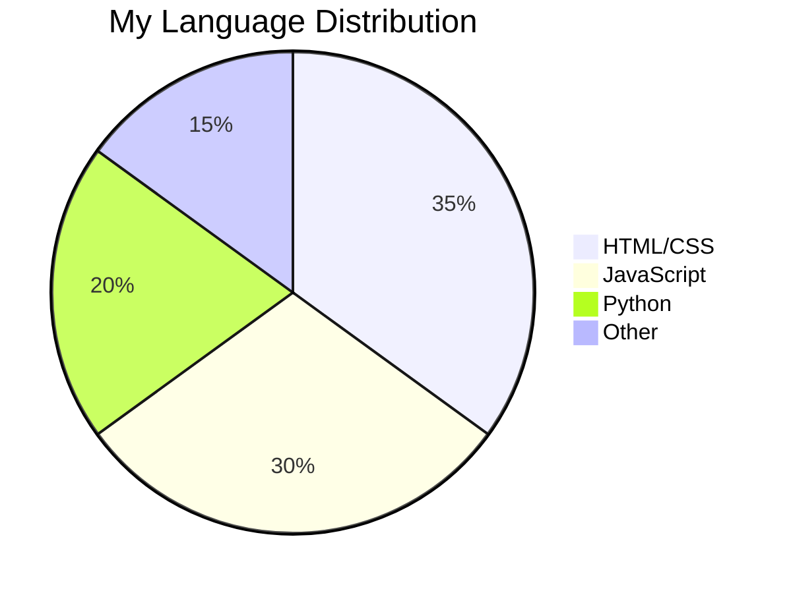

Here's your complete GitHub profile README with all stats and visualizations pre-configured for your username `BirendraHansda23`:

```markdown
# 👋 Hi, I'm Birendra Kumar Hansda

[](https://www.linkedin.com/in/birendra-kumar-hansda)
[](https://github.com/BirendraHansda23)
[](https://github.com/BirendraHansda23)

**Creative Developer** | Graphic Design + Web Development

## 📊 GitHub Language Stats


## 🛠 Tech Stack Breakdown


## 🌟 Profile Analytics
<table>
  <tr>
    <td>
      
    </td>
    <td>
      
    </td>
  </tr>
</table>

## 📈 Visitor Graph


## 🎨 Design + Dev Skills
```mermaid
gauge
    title Skill Level
    "Web Design" : 75
    "Graphic Design" : 85
    "Frontend Dev" : 65
    "UI/UX" : 80
```

### 🔧 Technologies I Work With
<p>
  
  
  
  
  
  
  
</p>

## 📌 Currently Learning
<p>
  
  
  
</p>

📫 **Let's collaborate!** Open for design/development projects
```


<!---
BirendraHansda23/BirendraHansda23 is a ✨ special ✨ repository because its `README.md` (this file) appears on your GitHub profile.
You can click the Preview link to take a look at your changes.
--->
